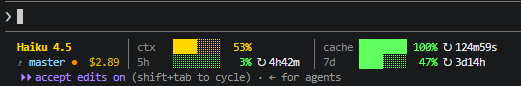

# Claude Code Statusline

A two-line status bar for Claude Code with color-coded usage metrics, cache hit rates, git branch tracking, and session cost.

## Preview



## Information

- **Model & Effort**: Color-coded by model size (Haiku=yellow, Sonnet=green, Opus=red) and effort level
- **Context Window**: Green/yellow/orange/red based on usage percentage
- **Cache Hit Rate**: Inverted scale (high hit = good, green; low hit = bad, red)
- **Token Limits**: 5-hour and 7-day usage with countdown timers
- **Git Integration**: Branch name with dirty indicator (●)
- **Session Cost**: Running total of API costs

## Installation

### Windows (PowerShell)

Run this command in PowerShell:

```powershell
irm https://path/to/install.ps1 | iex
```

Or locally:

```powershell
powershell -ExecutionPolicy Bypass -File install.ps1
```

### Linux / macOS (Bash)

Run this command:

```bash
curl -sSL https://path/to/install.sh | bash
```

Or locally:

```bash
bash install.sh
```

## What the Installer Does

1. Creates `~/.claude/` directory if needed
2. Copies the appropriate statusline script (`statusline-command.ps1` or `statusline-command.sh`)
3. Updates `~/.claude/settings.json` to configure the statusLine setting
4. Verifies the setup

## Manual Setup

**Windows:**
```json
{
  "statusLine": {
    "type": "command",
    "command": "pwsh -ExecutionPolicy Bypass -File \"$HOME\\.claude\\statusline-command.ps1\""
  }
}
```

**Linux/macOS:**
```json
{
  "statusLine": {
    "type": "command",
    "command": "bash ~/.claude/statusline-command.sh"
  }
}
```

## Requirements

- **Windows**: PowerShell 5.0+
- **Linux/macOS**: bash, jq, git
